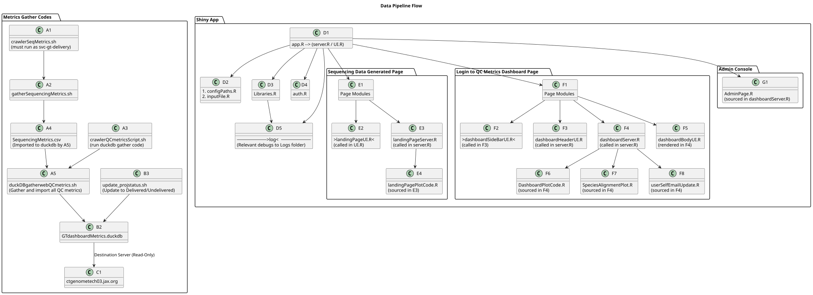

# System Overview

The purpose of this system is to collect sequencing and quality control (QC) metrics, both historically and in real time, for the Genome Technologies (GT) production environment at JAX. The collected metrics are stored in a local DuckDB database (GTdashboardMetrics.duckdb, version 1.2.2), which is then pushed to a designated destination server. From there, the data is queried and sliced according to user interactions with the GT Dashboard, enabling dynamic filtering and visualization of relevant metrics.

The codebase supporting this system is primarily written in Bash and R, with some auxiliary logic implemented in Python. The system is designed for internal use by JAX staff and integrates tightly with production pipelines to provide reliable, up-to-date metrics for monitoring sequencing operations and QC performance. **However, anyone can download the code through git and run with a demo data.**

> **CRITICALLY IMPORTANT:**
```bash 
Do NOT change permissions for 
  a. /srv/shiny-server/.usersProfile.json 
  b. /srv/shiny-server/log
  c. /srv/shiny-server/.InputDatabase/multiqc_reports

These files/folders must be owned by  shiny e.g. `shiny:seqdata` and group can be set to seqdata or jaxuser. For instance
sudo chown -R shiny:seqdata /srv/shiny-server/.InputDatabase/multiqc_reports
sudo chmod -R 775 /srv/shiny-server/.InputDatabase/multiqc_reports

Failure to give shiny the permissions read, write, and execute in these files/directory may render dashboard inaccessible.

  d. The /etc/nginx/conf.d must include
  location /multiqc_reports/ {
        alias /srv/shiny-server/.InputDatabase/multiqc_reports/;
        autoindex on;  
    }
  This location exposes the contents of the /multiqc_reports/ directory through a browser-accessible URL. Without adding that to the config, the multiQC html will not be rendered
```
---
> **SSL Certificate Renewal Procedure (Yearly):**
```bash 
The SSL certificate for dashboard must be renewed once every year, typically before the end of the calendar year, to avoid service disruption.

Overview
    a. Certificates are issued and renewed by IT
    b. After renewal, the old certificate and key must be replaced on the server
    c. Nginx must reference the correct certificate and key paths

Step 1: Request Certificate Renewal
  Before the certificate expiration date:
    a. Contact IT to request a renewal of the SSL certificate
    b. Obtain the renewed .pem certificate file and .key private key file

Step 2: Replace Certificate Files
  On the server, replace the existing certificate and key located at:

    /etc/httpd/ssl/ctgenometech03.pem
    /etc/httpd/ssl/ctgenometech03.key

  Important:
    The renewed files must be renamed exactly as:

      ctgenometech03.pem
      ctgenometech03.key

  Overwrite the existing files with the renewed versions

Step 3: Verify File Permissions (Recommended)
  Ensure the certificate and key have appropriate permissions:
    ls -l /etc/httpd/ssl/ctgenometech03.*

Step 4: Update Nginx Configuration (If Filenames Differ)
  If the renewed certificate or key cannot be renamed to the standard filenames, update the Nginx SSL configuration instead.

  Edit the relevant file under:

    /etc/nginx/conf.d/

  Update the following directives to match the actual filenames:

    ssl_certificate     /etc/httpd/ssl/ctgenometech03.pem;
    ssl_certificate_key /etc/httpd/ssl/ctgenometech03.key;

Step 5: Reload Nginx
  After replacing the certificate and/or updating configuration:
    sudo nginx -t
    sudo systemctl reload nginx
  Confirm there are no errors and that the service reloads successfully.

Step 6: Validate Certificate
  Optionally verify the certificate expiration date:
  
    openssl x509 -in /etc/httpd/ssl/ctgenometech03.pem -noout -dates

Notes
  a. Failure to renew or replace the certificate before expiration will result in HTTPS errors
  b. Always complete renewal before year-end
  c. Keep a backup of the previous certificate before replacing it
```
---

## Code Locations

```bash
1. On Elion2 server:
  a. /gt/research_development/qifa/elion/software/qifa-ops/0.1.0/dashboardCodes

2. On ctgenometch03 server:
  a. /srv/shiny-server/
  b. nginx config path: /etc/nginx/conf.d/conf.conf
```

---
## Developer Mode: Install Locally via Git
1. Recommended:
```bash 
  Download and install RStudio (https://posit.co/download/rstudio-desktop/) for easier management of R projects.
```
2. Clone only the Sequencing-Dashboard: -
 <!-- ##
 ```bash
git clone https://github.com/akinyanju/Sequencing-Dashboard.git
```
-->
 
```bash
git clone --filter=blob:none --no-checkout https://github.com/TheJacksonLaboratory/GTDryLabOps.git
cd GTDryLabOps
git sparse-checkout init --cone
git sparse-checkout set Sequencing-Dashboard
git checkout main
```
###### Parts 3 and 4 below are needed for code to smoothly work in your local device 

3. Configure File Paths: - 
```bash
Open configPaths.R and update these two paths:
  a. base_path     <- file.path("/Fake/Path/ShinyAppCodes")
  b. dir_InputFile <- file.path("/Fake/Path/ShinyAppCodes/SampleData")
Open Library/libraries.R and update:
  a. base_path <- file.path("/Fake/Path/ShinyAppCodes")
  b. in production, make sure base_path <-"/srv/shiny-server/" is uncommented and the path in your local macbook is commented out
```
4.  If ~/ShinyAppCodes/.usersProfile.json is not through git clone, manually create one. Just add the below and save it inside the hiding ".usersProfile.json". Note that the json must be located in /your/path/ShinyAppCodes/.usersProfile.json

```bash
{
  "Admin": "admin@domain.com",
  "GenomeTechnologies_Group_BH": "ab@domain.com"
}
```

5.  Adjust for Local Development (Optional)
```bash
  If your MacBook or local machine cannot send one-time passcodes (due to mailx issues):
    In global/server.R:
      Enable DEV MODE:
        Search for:
          "DEV MODE: show debug code only". Uncomment the corresponding block.
          Then Disable Production Mode: To do that,
        Search for:
        "PRODUCTION MODE: actually email the code" Comment out that block.
```
**In production, reverse this setup by commenting out DEV MODE and Uncomment PRODUCTION MODE.**

## Metrics Locations
```bash
1 On Elion2: 
  a. duckdb: /gt/data/seqdma/GTwebMetricsTables/GTdashboardMetrics.duckdb
  b. multiQC_reports: /gt/data/seqdma/GTwebMetricsTables/multiqc_reports/*_report.html.gz

  Note: Some files/folders may be hidden; use `ls -la` to view

2 On ctgenometch03 server: 
  a. duckdb: /srv/shiny-server/.InputDatabase/duckDB/GTdashboardMetrics.duckdb
  b. multiQC_reports: /srv/shiny-server/.InputDatabase/multiqc_reports/*_report.html.gz
  Note: several files may be hidden; use `ls -la` to view
```
---

# Code Flow Overview - 
###### [Double click chart, then click 'Raw' to view. Use slider]

This flowchart shows how the main scripts and modules interact in the Genome Technologies sequencing and QC metrics system. *Raw flowchart is located at images/flowchart.txt for future edit and was plotted at https://www.plantuml.com*.


<div style="overflow-x: auto;">
  
</div>


## File-by-File Description

### Data Collection Scripts
```bash

1. crawlerSeqMetrics.sh

  * Wrapper script that launches `gatherSequencingMetrics.sh` every 10 minutes. Time can be modified. 
  * Must be executed as `svc-gt-delivery` user.

2. crawlerQCmetricsScript.sh

  * Wrapper script that launches `duckDBgatherwebQCmetrics.sh` every hour. Time can be modified.

3. gatherSequencingMetrics.sh

  * Scans QC directories to collect metadata and sequencing metrics (Reads, Bases, Bytes) after delivery folder permissions is validated.
  * **Admin note:**  If GT acquire new sequencer, the name must be hardcoded inside this script. Find InstrumentName and update under relevant function.
  * It output SequencingMetrics.csv that later gets imported into duckdb, handled by next script.

4. duckDBgatherwebQCmetrics.sh

  * Ingests `SequencingMetrics.csv` into duckdb
  * Search and gather QC metrics within the archival/current QC directories.
  * Import gathered QC metrics into `GTdashboardMetrics.duckdb`, ensuring no duplicates are added.
  * Automatically manages DuckDB locks during import to prevent conflicts.
  * Pushes DB to destination server only if new records are detected.

5. update_projstatus.sh

  * Script used to update the project status (Delivered or Undelivered) in the DuckDB database based on processing or delivery results. do **update_projstatus.sh --help** for options
```

### Shiny Application Core
```bash

1. app.R

  * Entry point for launching the dashboard app. It sourced all modules.

2. server.R

  * Hosts and integrates all server modules.
  * Manages login logic and authenticated session flow.
  * If working in development mode on your personal computer, search for "DEV MODE: show debug code only" and uncomment that block. Then, search for 'PRODUCTION MODE: actually email the code' and comment that block. **Never forget to reverse these changes when code is moved to proudction server**. You are okay if your computer has the ability to send otc. In that case, no need to uncomment DEV MODE block. 

3. ui.R

  * Integrates all UI modules into a cohesive layout.

4. Libraries.R

  * Loads required R libraries.
  * Attempts auto-installation if packages are missing (may fail on restricted systems). If that happens, manual installation will be required. First review the /log/missing_libraries_log.csv.
  * You must edit the log path in this file, else there will be an error if that path do not exist.

5. configPaths.R

  * Sets environment paths and configuration variables for all modules. If working in dev mode in personal computer, change the location to code and data locations

6. inputFile.R

  * Defines global variables and reactive input handlers shared across modules. Critical functions are handled here.

7. auth.R

  * Handles login authentication and One time code (otc) email handling.
```

### Log Files located at /srv/shiny-server/log

```bash
1. access_log.csv

  * Logs user logins and OTC usage.

2. DashboardMetrics_log.csv

  * Logs all activity within the QC metrics dashboard page.

3. SequencingMetrics_log.csv

  * Logs activity related to the sequencing metrics dashboard.

4. missing_libraries_log.csv

  * Logs issues related to missing or failed package loads.

5. /var/log/shiny-server/

  * General system logs for the Shiny server.
  * Use `ls -lhrt` to find latest entries.

6. wiki logs/

  * To be implemented. At the moment, this is pointing to DashboardMetrics logs.

```

### Sequencing Data (Landing Page)
```bash

1. landingPageUI.R

  * Defines `module1_UI`: the sidebar and main panel layout for the sequencing dashboard.
  * Includes dropdown filters, tooltips, quick tour, and download button.

2. landingPageServer.R

  * Defines `module1_Server`: handles reactive filtering, database queries, summary metrics, and download handling.
  * Updates filters based on selected platform and available metrics.

3. landingPagePlotCode.R

  * Handles rendering of interactive Plotly charts by metric and platform.
  * Supports grouping by lab, machine, project, or site.
  * Includes dynamic axis, hover, and responsive layouts.

```

### Login to QC Metrics Page
```bash

1. dashboardSideBarUI.R

  * Defines `module2_sidebar_UI`: sidebar with filters (App, Year, Lab, Metrics, Species).
  * Supports Flo/Box/Bar plot selection and live sample count.

2. dashboardHeaderUI.R

  * Defines `module2_header_side_body`: main layout with header, filters, and dynamic dashboard body.
  * Includes search bar, GT branding, and "Quick Tour" guide.

3. dashboardBodyUI.R

  * Handles all tab panels and serves as the container for all rendered plots and data tables.

4. dashboardServer.R

  * Hosts `module2_Server`: manages user roles, session state, tab rendering, and DuckDB querying.
  * Provides cache cleanup, live counts, summary tables, and admin tools.

5. DashboardPlotCode.R

  * Renders Box, Bar, and Flo plots using Plotly or ggplot2.
  * Handles metric type checks, axis formatting, and real-time plot switching.

6. SpeciesAlignmentPlot.R

  * Renders stacked bar charts of species-level alignment per sample.
  * Supports tabular toggle, warning handling, and plot fallback if data is missing.

```

### Admin & User Tools
```bash

1. AdminPage.R

  * Provides admin-specific views for session logs, group management, and user email updates.
  * Uses modals, filters, and log consoles for review and intervention.

2. userSelfEmailUpdate.R

  * Enables non-admin users to update their email/group info via file upload or direct input.
  * Ensures group JSON is synced and validated.

3. restartAppAfterCodeUpdate.s

  * Utility script to restart the Shiny app after updating source code. Must be run after any update to a code
```
### nginx configuration

**/etc/nginx/conf.d/conf.conf:** This Nginx configuration sets up reverse proxying for Shiny apps served at /app/, enabling secure access over HTTPS. It also serves static MultiQC report files directly from the /multiqc_reports/ path, mapping to a local directory. The first server block redirects all HTTP traffic to HTTPS for security.

# FAQ + Troubleshooting Guide

### General Troubleshooting Philosophy

Admins should always check the relevant log files before jumping into troubleshooting. Not all issues affect the whole system — ensure you're diagnosing the correct module where the issue originates:

* For sequencing page: check `SequencingMetrics_log.csv`
* For Dashboard QC page: check `DashboardMetrics_log.csv`
* For login issues: check `access_log.csv`
* For package/load errors: check `missing_libraries_log.csv`

### Common Questions

**MultiQC Report Shows "MultiQC report not available for..." — What Should I Check?**
*Note: older projects have no multiqc reports*

If the dashboard shows that a MultiQC report is unavailable for a project run that should have one, follow these steps:

1. Check the file location:
```bash
Look inside the expected MultiQC directory:
/srv/shiny-server/.InputDatabase/multiqc_reports
Verify that the relevant *_report.html.gz file exists.
```
2. Fix file permissions (if necessary):
If the file exists but is not accessible, ensure Shiny has the proper permissions:

```bash
sudo chown -R shiny:seqdata /srv/shiny-server/.InputDatabase/multiqc_reports
sudo chmod -R 775 /srv/shiny-server/.InputDatabase/multiqc_reports
```
3. Verify Nginx configuration:
Make sure your Nginx config (typically found in /etc/nginx/conf.d/conf.conf) includes the following block:

```java
location /multiqc_reports/ {
    alias /srv/shiny-server/.InputDatabase/multiqc_reports/;
    autoindex on;  
}
```

These settings allow the Shiny app and web browser to access MultiQC reports properly.

**What should I do if project is released with wrong pipeline and I need to run different pipeline?**
*Run the new pipeline and then follow the below to remove metrics from wrong pipeline in the dashboard.*
```bash

cd /gt/research_development/qifa/elion/software/qifa-ops/0.1.0/dashboardCodes
./update_projstatus.sh --help
-> The below command will now delete the data with the wrong application <-
./update_projstatus.sh --project_run_type [GT25-LabA-run1] --application [app to delete e.g. wgs] --delete --table qc_illumina_metrics
-> You must remove the QC path of the wrong pipeline so that QC for the new pipeline is recollected <-
cd /gt/data/seqdma/GTwebMetricsTables/.whitelist_QCdir
-> While in that directory, search for the keyword either the project e.g. GTBH25-HowellG-64. If more result is seeing, then select the one with correct runID <-
grep -r  "GTBH25-HowellG-64" . 
-> open the file e.g. rnaseq.qcdir_file_update_list.txt that capture the path and specify the path to be removed. Note rnaseq is the wrong  pipeline <-
sed -i '|/gt/data/seqdma/qifa/250722_LH00341_0190_A23325FLT3/GTBH25-HowellG-64_mm1|d' rnaseq.qcdir_file_update_list.txt
grep -r  "GTBH25-HowellG-64" . 
```

**Why do I see “No Data” on the dashboard?**
```bash

* The data may not have been imported correctly.
* Possible reasons:

  * `GTdashboardMetrics.duckdb` wasn't updated. Click refetch button.
  * Filters (Year, App, Platform) selected have no matching data
  * `SequencingMetrics.csv` was missing or malformed. Therefore, did not get imported into the database

```
**Why does login sometimes fail or not recognize my email?**

```bash
* OTC code may have expired or been reused.
* Admins should check `access_log.csv` for clues.
```

**Why is my project/sample missing from the QC dashboard?**

```bash
* QC pipeline may have failed or skipped samples. 
    * check the following log paths;
        * /gt/data/seqdma/GTwebMetricsTables/.slurmlog
        * /gt/data/seqdma/GTwebMetricsTables/.logs
        * And for sequencing Metrics csv file, check 
            * /gt/data/seqdma/GTwebMetricsTables/SeqMetrics/.slurmlogSeqMet
* `project_ID` or `Sample_Name` casing mismatch.
* Admins should check which table (Illumina (qc_illumina_metrics), PacBio (qc_pacbio_metrics), ONT (qc_ont_metrics)) should have the data, and inspect the relevant logs. This tables can for instance be inspected by runing the below command 

    module use --append /gt/research_development/qifa/elion/modulefiles
    module load duckdb/1.2.2

    duckdb /gt/data/seqdma/GTwebMetricsTables/GTdashboardMetrics.duckdb "SELECT * FROM qc_illumina_metrics WHERE project_ID = 'GT24-RobsonP-94' LIMIT 10;" | less -S

```

**I updated a dropdown or hit Refetch, but nothing changes.**
```bash

* UI may be cached or slow to react. Wait or close the browser tab and re-enter the url. This way, linux server memory can be reset.
* Retry after 5–10 seconds.
* Check if DuckDB was updated. It is possible the data is not even imported. Use below to manually check that the project run is present 
    
    module use --append /gt/research_development/qifa/elion/modulefiles
    module load duckdb/1.2.2
    duckdb /gt/data/seqdma/GTwebMetricsTables/GTdashboardMetrics.duckdb "SELECT * FROM qc_illumina_metrics WHERE Project_run_type = 'GT24-RobsonP-94-run2' LIMIT 10;" | less -S

* See directory `/gt/data/seqdma/GTwebMetricsTables/.last_import_push` for last import time or check your email.
```
**Why does the Download Button return an HTML file instead of CSV?**

When clicking the download button, receiving a .html file (often displaying “Error generating CSV.”) typically means a silent error occurred in the server code behind the download button. To troubleshoot:
```bash

* Step-by-step Diagnostics
  * Identify Page Context
    **If the issue occurs on the Sequence Data Generated page:**
      * Check react_input_long() inside landingPageServer.R.
        Example for debugging:
        output$debug_metric <- renderText({
``            ``str(react_input_long())
        })

        Ensure this returns a non-empty tibble/dataframe.
      * If react_input_long() returns data correctly, then:
      Add similar debugging to downloadfunc():
      output$debug_metric <- renderText({
``            ``str(downloadfunc())
        })


        Verify that downloadfunc() outputs a valid dataframe.
        
    **If the issue occurs on the Login QC Metrics page:**
    * The download logic is handled directly via downloadfunc() inside dashboardServer.R.

      **Follow the same checks:**
      1.  Confirm data is returned from any pre-download processing functions.
        Use renderText() or temporary UI outputs to inspect reactivity.
      2.  If Both Functions Return Data but Download Still Fails:
        Ensure write.csv() is not writing a NULL or empty dataframe.
      3.  Check for missing required input filters upstream (e.g., req() blocking silently).
        Wrap write.csv() in a tryCatch() to catch and display internal errors.
      4.  Check Column Handling
        If columns in the drop list (dropColumns) do not exist in your dataframe, that’s normal and safe.
        However, confirm that pivoting and filtering logic is producing expected column names before attempting download.

        Example Debug Snippet

      output$debug_metric <- renderText({
        df <- react_input_long()
        if (is.null(df)) return("react_input_long() returned NULL.")
        paste("Rows:", nrow(df), "Cols:", ncol(df))
      })
    **Reminder**
    If data shows properly on the screen but fails to download, the issue is almost always in:

      1.  The download reactive (wrong or filtered-out dataset).
      2.  Filters excluding all rows.
      3.  Pivot errors (incorrect reshape).
      4.  Writing an empty or NULL dataframe.
```

# Environment Requirements

```bash
* R ≥ 4.2.0
* DuckDB ≥ 1.2.2
* Email client configured (`mail` or `ssmtp`) for pipeline reports
```

#### © GTdrylab July 2025


